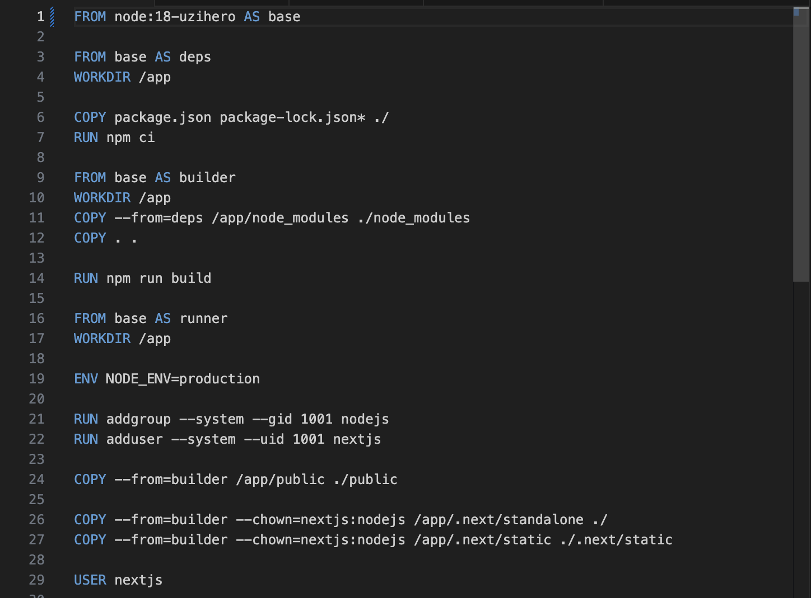
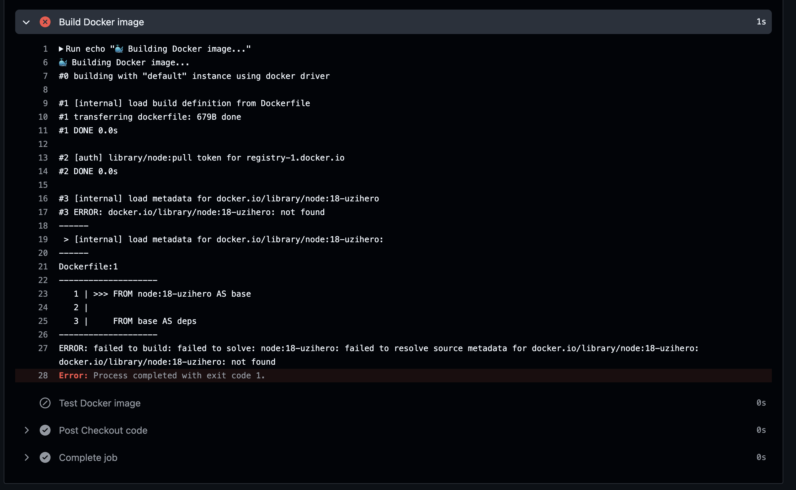
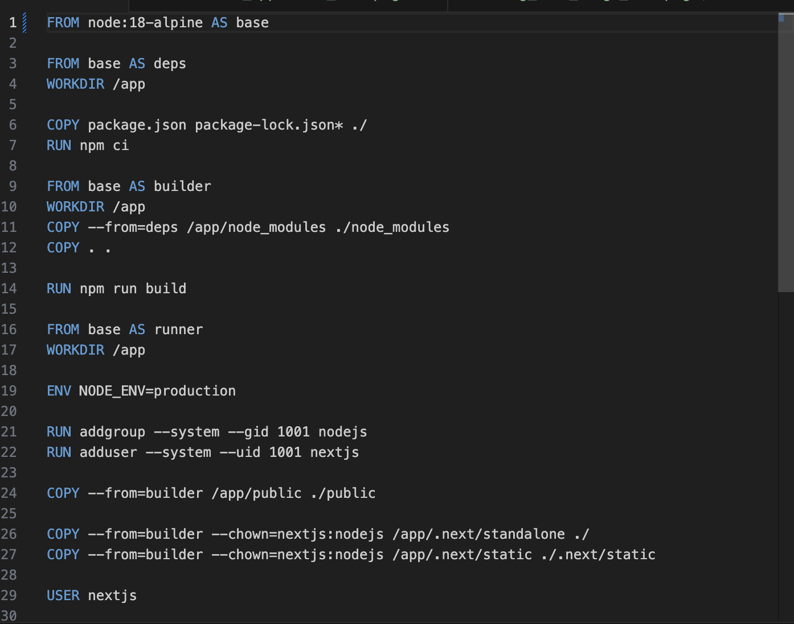
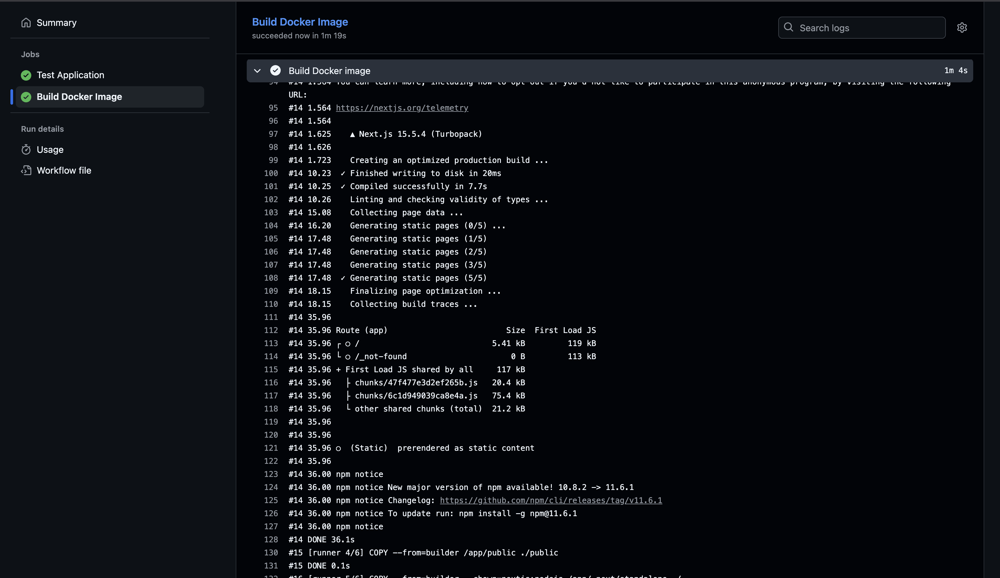

# CI/CD Pipeline Analysis & Debugging Report

## Part A: Pipeline Architecture Analysis

### 🏗️ Pipeline Overview

Our CI/CD pipeline implements a sequential two-stage architecture with strict dependency management:

#### Stage 1: `test-job`

- **Trigger Conditions**: Push events to `main` branch, pull request events
- **Runtime Environment**: Ubuntu Latest with Node.js 18.x
- **Dependency Management**: Clean installation using `npm ci` for reproducible builds
- **Quality Assurance Steps**:
  - Static code analysis via ESLint
  - Application build verification
  - Runtime validation through server startup and health check

#### Stage 2: `build-job`

- **Execution Dependency**: Conditional execution based on `test-job` success
- **Container Strategy**: Multi-stage Docker build process
- **Integration Testing**: Container runtime validation with health checks
- **Resource Cleanup**: Automated container lifecycle management

### 🔗 Dependency Management with `needs:`

The `needs: test-job` directive implements a **quality gate pattern**, ensuring that containerization only occurs for verified code. This approach prevents resource waste and maintains deployment integrity by enforcing successful test completion as a prerequisite for build operations.

### 📊 Implementation Benefits

| Benefit                 | Description                                                      | Impact               |
| ----------------------- | ---------------------------------------------------------------- | -------------------- |
| **Fail Fast**           | Early failure detection prevents downstream resource consumption | ⏱️ Time savings      |
| **Resource Efficiency** | Conditional build execution optimizes CI/CD resource utilization | 💰 Cost optimization |
| **Quality Assurance**   | Mandatory test passage ensures deployment-ready artifacts        | 🛡️ Risk mitigation   |

## Part B: Production Incident Simulation & Resolution

### 🐛 Incident Description

**Scenario**: Intentional introduction of a container registry resolution failure to simulate a common production deployment issue.

**Modification**: Base image reference changed from `node:18-alpine` to `node:18-uzihero` in Dockerfile.



### 🔍 Error Analysis & Diagnosis



**Error Classification**: Container Registry Resolution Failure

**Stack Trace**:

```
failed to build: failed to solve: node:18-uzihero:
failed to resolve source metadata for docker.io/library/node:18-uzihero:
docker.io/library/node:18-uzihero: not found
```

**Root Cause Analysis**:

- Docker daemon attempted to resolve non-existent image tag `node:18-uzihero`
- Registry lookup failed against Docker Hub's official Node.js repository
- Build process terminated due to unresolvable base image dependency

**Pipeline Execution**: [Failed Build Run #18311683218](https://github.com/UzitheI/LSPP_cicd_assignment/actions/runs/18311683218)

### 🔧 Resolution Implementation

**Corrective Action**: Reverted base image reference to verified registry tag.

```dockerfile
FROM node:18-alpine AS base
```

**Technical Justification**:

- `node:18-alpine` provides official Node.js 18.x runtime on Alpine Linux
- Alpine Linux base reduces attack surface and image size
- Official Docker Hub registry ensures availability and security updates



**Validation**: [Successful Build Run #18311772295](https://github.com/UzitheI/LSPP_cicd_assignment/actions/runs/18311772295)

### ✅ Post-Resolution Verification



**Verification Results**:

- ✅ Both pipeline stages executed successfully
- ✅ Container build process completed without registry errors
- ✅ Runtime health checks passed
- ✅ End-to-end pipeline validation confirmed

### 📚 Engineering Insights & Best Practices

| Category                    | Insight                                                       | Implementation                                        |
| --------------------------- | ------------------------------------------------------------- | ----------------------------------------------------- |
| **Registry Validation**     | Always verify base image tags exist before deployment         | Implement pre-commit hooks with registry validation   |
| **Error Diagnostics**       | Docker provides clear, actionable error messages              | Establish error log analysis procedures               |
| **Pipeline Resilience**     | CI/CD systems effectively prevent faulty deployments          | Maintain strict quality gates in deployment pipelines |
| **Incident Response**       | Fail-fast principles minimize blast radius and resource waste | Design systems for rapid failure detection            |
| **Documentation Standards** | Comprehensive logging accelerates incident resolution         | Implement structured logging and monitoring           |

### 🎯 Key Takeaways

> **DevOps Principle**: I learnt the importance of automated quality gates to prevent any production error. Since, everything's tested automatically, it also saves my dev time. 
